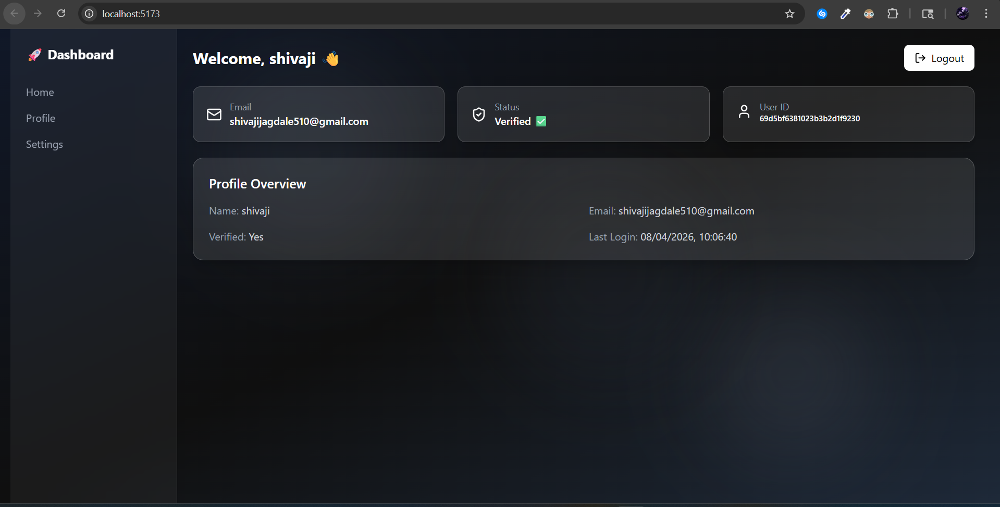
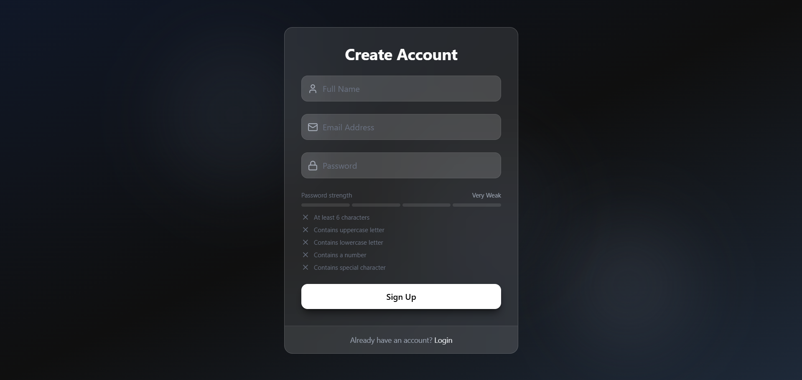

<div align="center">

<br/>

```
███╗   ███╗███████╗██████╗ ███╗   ██╗      █████╗ ██╗   ██╗████████╗██╗  ██╗
████╗ ████║██╔════╝██╔══██╗████╗  ██║     ██╔══██╗██║   ██║╚══██╔══╝██║  ██║
██╔████╔██║█████╗  ██████╔╝██╔██╗ ██║     ███████║██║   ██║   ██║   ███████║
██║╚██╔╝██║██╔══╝  ██╔══██╗██║╚██╗██║     ██╔══██║██║   ██║   ██║   ██╔══██║
██║ ╚═╝ ██║███████╗██║  ██║██║ ╚████║     ██║  ██║╚██████╔╝   ██║   ██║  ██║
╚═╝     ╚═╝╚══════╝╚═╝  ╚═╝╚═╝  ╚═══╝     ╚═╝  ╚═╝ ╚═════╝    ╚═╝   ╚═╝  ╚═╝
```

# 🔐 MERN Advanced Auth System

### Production-Grade Authentication — Secure · Scalable · Real-World Ready

<br/>


<br/>


</div>

---

## 🎯 Why This Project?

> Most auth tutorials stop at the basics. This doesn't.

This system is built with **production-level practices** used in real-world applications — the kind you'd actually ship to users, not just demo in a YouTube video.

```
What you get here ↓

  🔐 HTTP-only cookie auth    →   No token exposure in localStorage
  📧 Email OTP verification   →   Real signup flow with Mailtrap
  🔑 Forgot/Reset Password    →   Secure time-limited reset links
  🚧 Protected Routes         →   Middleware-guarded endpoints
  ⚡ Zustand state mgmt       →   Lightweight & reactive global state
  🛡️  XSS-proof architecture  →   JWT never touches JS memory
```

---

## 🖼️ Preview

| Dashboard | Auth Flow |
|:---------:|:---------:|
|  |  |

---

## 🏗️ Architecture

```
┌─────────────────────────────────────────────────────────────────┐
│                        CLIENT (React + Vite)                    │
│         Zustand Store  ←→  Axios Interceptors  ←→  React Router │
└───────────────────────────────┬─────────────────────────────────┘
                                │  HTTPS + HTTP-only Cookie
                                ▼
┌─────────────────────────────────────────────────────────────────┐
│                      API SERVER (Express.js)                    │
│                                                                 │
│   /api/auth/signup       →   Register + Send OTP Email          │
│   /api/auth/verify-email →   Validate OTP Token                 │
│   /api/auth/login        →   Issue JWT in Cookie                │
│   /api/auth/logout       →   Clear Cookie                       │
│   /api/auth/forgot-pwd   →   Send Reset Link                    │
│   /api/auth/reset-pwd    →   Validate & Update Password         │
│   /api/auth/me           →   Protected — requires valid JWT     │
└───────────────────────────────┬─────────────────────────────────┘
                                │
               ┌────────────────┴────────────────┐
               ▼                                 ▼
┌──────────────────────┐             ┌───────────────────────┐
│   MongoDB Atlas       │             │   Mailtrap (Email)    │
│   User Collection     │             │   OTP / Reset Links   │
│   bcrypt passwords    │             │   Nodemailer          │
└──────────────────────┘             └───────────────────────┘

         Auth Middleware Flow:
         Request → verifyJWT() → extract cookie → decode token
                 → attach req.user → proceed to controller
```

---

## 🚀 Features

### 🛡️ Security First
- **JWT in HTTP-only cookies** — tokens are invisible to JavaScript, XSS-proof
- **bcrypt password hashing** — industry-standard one-way hashing
- **CORS configured** — only your frontend domain is whitelisted

### 🔄 Complete Auth Flows
- ✅ **Signup** — register with name, email, password
- 📧 **Email Verification** — OTP sent on signup, must verify before login
- 🔑 **Forgot Password** — email link with time-limited token
- 🔒 **Reset Password** — token validation + new password set
- 🚧 **Protected Routes** — `verifyJWT` middleware on guarded endpoints

### ⚡ Frontend State
- **Zustand** for lightweight, boilerplate-free global auth state
- **Axios** with base URL config + credential support
- **React Hot Toast** for clean UX feedback

### 🎨 Modern UI
- Responsive **dark mode** design with Tailwind CSS
- Clean component-based structure with React Router DOM

---

## 🛠️ Tech Stack

<table>
<tr>
<th>Frontend</th>
<th>Backend</th>
</tr>
<tr>
<td>

| Tool | Purpose |
|------|---------|
| React (Vite) | UI framework |
| Zustand | Global state |
| Tailwind CSS | Styling |
| React Router DOM | Client routing |
| Axios | HTTP requests |
| React Hot Toast | Notifications |

</td>
<td>

| Tool | Purpose |
|------|---------|
| Node.js | Runtime |
| Express.js | Web framework |
| MongoDB + Mongoose | Database + ODM |
| JWT | Auth tokens |
| bcryptjs | Password hashing |
| Nodemailer | Email sending |

</td>
</tr>
</table>

---

## ⚙️ Installation & Setup

### 1️⃣ Clone the Repository

```bash
git clone https://github.com/TheShivaji/MERN-Advanced-Auth.git
cd MERN-Advanced-Auth
```

### 2️⃣ Install Dependencies

```bash
# Install frontend dependencies
cd Frontend
npm install

# Install backend dependencies
cd ../Backend
npm install
```

### 3️⃣ Configure Environment Variables

Create a `.env` file inside the `Backend/` folder:

```env
# Server
PORT=5000

# Database
MONGO_URI=your_mongodb_connection_string

# Auth
JWT_SECRET=your_super_secret_jwt_key

# Email (Mailtrap)
MAILTRAP_HOST=smtp.mailtrap.io
MAILTRAP_PORT=2525
MAILTRAP_USER=your_mailtrap_username
MAILTRAP_PASS=your_mailtrap_password
```

> 💡 Get your Mailtrap credentials free at [mailtrap.io](https://mailtrap.io)

### 4️⃣ Run the Project

Open **two terminals** and run:

```bash
# Terminal 1 — Backend
cd Backend
npm run dev

# Terminal 2 — Frontend
cd Frontend/Auth-ui
npm run dev
```

App will be live at → `http://localhost:5173`

---

## 📁 Folder Structure

```
MERN-Advanced-Auth/
├── Backend/
│   ├── controllers/
│   │   └── auth.controller.js      # Signup, Login, Verify, Reset
│   ├── middleware/
│   │   └── verifyJWT.js            # JWT cookie validation
│   ├── models/
│   │   └── user.model.js           # Mongoose User schema
│   ├── routes/
│   │   └── auth.routes.js          # /api/auth/* endpoints
│   ├── utils/
│   │   └── sendEmail.js            # Nodemailer + Mailtrap config
│   └── server.js                   # App entry point
│
└── Frontend/
    └── Auth-ui/
        ├── src/
        │   ├── components/         # Reusable UI components
        │   ├── pages/              # Login, Signup, Dashboard, etc.
        │   ├── store/              # Zustand auth store
        │   └── App.jsx             # Router + protected routes
        └── vite.config.js
```

---

## 📌 Key Highlights

| Feature | Implementation |
|---------|---------------|
| Token Storage | HTTP-only cookie (not localStorage) |
| XSS Protection | Tokens inaccessible to JavaScript |
| Password Security | bcrypt with salt rounds |
| Email OTP | 6-digit code, time-limited |
| Reset Flow | Crypto-signed URL token |
| Route Protection | `verifyJWT` middleware |

---

## 👨‍💻 Author

<div align="center">

### Shivaji Jagdale

**Full-Stack Developer · AI Builder · MERN Specialist**

*Building production-ready systems · Secure auth & backend architecture · Exploring Agentic AI & GenAI*

[](https://github.com/TheShivaji)
[](https://linkedin.com/in/your-link)
[](mailto:your-email@example.com)

</div>

---

## 🤝 Contributing

Pull requests are welcome! For major changes, please open an issue first to discuss what you'd like to change.

```
1. Fork the repo
2. Create your branch    →  git checkout -b feature/amazing-feature
3. Commit your changes   →  git commit -m 'feat: add amazing feature'
4. Push to the branch    →  git push origin feature/amazing-feature
5. Open a Pull Request
```

---

## ⭐ Support

If this project helped you, please consider:

- ⭐ **Starring** the repo
- 🍴 **Forking** it for your own projects
- 📢 **Sharing** it with fellow developers

---

<div align="center">

Made with 🔐 by [Shivaji Jagdale](https://github.com/TheShivaji)

*Production-grade auth, not tutorial-grade.*

</div>
